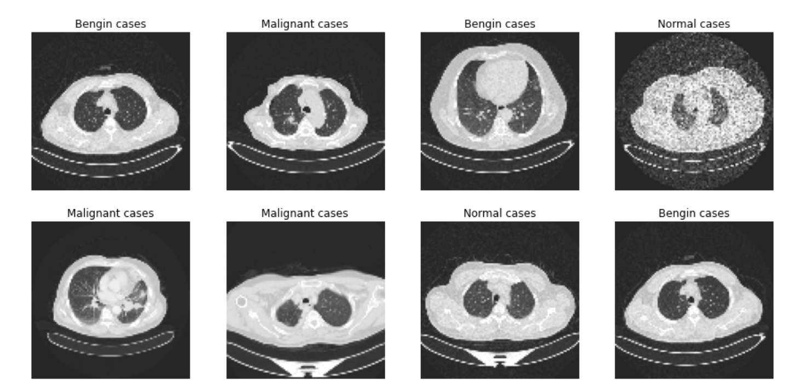

<!-- <h1 align="center" style = font-size: 200px>MedScale</h1> -->
<!-- <h1 align="center">
    
</h1>  -->
 


 
FedVit is a transformer based model for research!| 

## Quick Start 🚀

We provide an end-to-end example for users to start running a medical vit!.

### Step 1. Installation📚

First of all, users need to clone the source code and install the required packages (we suggest python version >= 3.9). 

```bash
git clone https://github.com/erfandarzi/Vit_FL.git
cd Vit_FL
```

#### Use Conda

We recommend using a new virtual environment to install Medscale:

```bash
conda create -n Vit_FL python=3.9
conda activate Vit_FL
```

If your backend is torch, please install torch in advance ([torch-get-started](https://pytorch.org/get-started/locally/)). For example, if your cuda version is 11.3 please execute the following command:

```bash
conda install -y pytorch=1.10.1 torchvision=0.11.2 torchaudio=0.10.1 torchtext=0.11.1 cudatoolkit=11.3 -c pytorch -c conda-forge
```

For users with Apple M1 chips💻:
```bash
conda install pytorch torchvision torchaudio -c pytorch
```

Finally, after the backend is installed, you can install our repository from `source`:

##### From source

```bash
pip install .
```

Now, you have successfully installed the minimal version of our repository. (**Optinal**) 
 ## Example Usage: Federated lung cancer classification 
<h1 align="center">
    
</h1> 

### Downloading Lung cancer dataset📋

You can download lung cancer dataset from kaggle and put it in `data/lung`  directory.


 
### Running training script
 
To run a federated learning example with `FedOPT` algorithm, for unbalanced dataset run:
```bash 
python medscale/main.py --cfg scripts/my_configs/FedOPT_Lung_cancer.yaml
```

All adjustable parameters can be found in the second cell. Careful with the `BATCH_SIZE`, as we are using it to parallelize head and time chunk calculations.

## License

Our work is under MIT license. Credits to  <a href="https://arxiv.org/abs/2204.05011" target="_blank">Federated Scope</a>   for their amazing pipeline.
 
